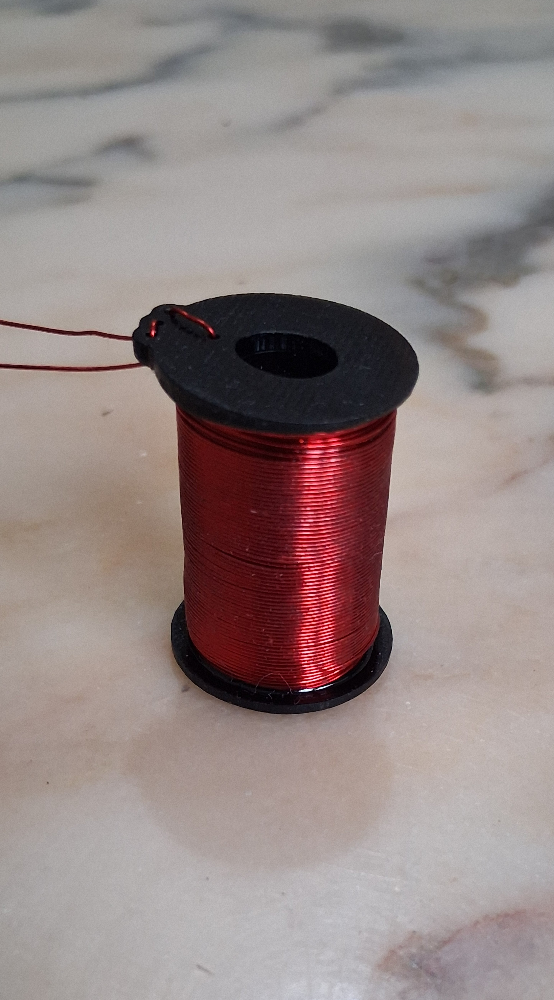
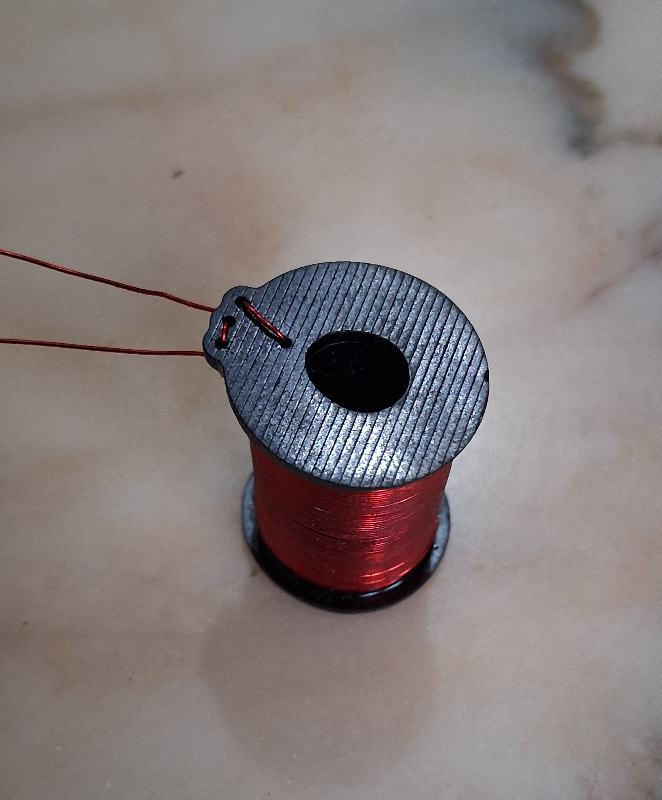
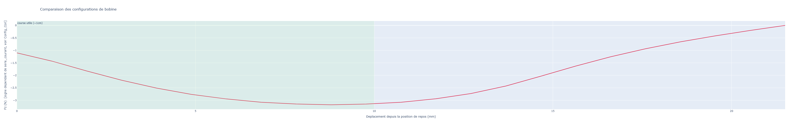

# Clavicore 
## Le projet
> Piloter un clavecin à distance grâce à un clavier ergonomique

## L’instrument
La base est une copie d’une épinette italienne de 1601, vendue dans les années 70 en kit par Heugel et montée par un amateur. L’instrument a été révisé (changement des cordes, réharmonisation à la plume, rebouchage d’une fente sur la table d’harmonie). 

Le système électronique sera intégré au corps de l’instrument.

## L’automatisation

## Moitié « Moteur »
*PCB en cours de fabrication*

La carte de contrôle est basée sur un RP2354B avec un DRV8874 par solénoïde pour un contrôle bidirectionnel. Cinq cartes permettent de gérer les 49 touches du clavier. Les cartes communiquent en CAN.

### Moitié « Clavier »
*PCB en cours de fabrication*

Simple matrice de touches gérée par un Pico 2. Les événements « touches pressées » sont communiqués en CAN avec la partie « moteur » du système. Ils pourront également être transmis en MIDI à un ordinateur.

Ce projet utilisera une base de clavier ergonomique (https://github.com/MartinDrillon/IteMX3-) adaptée pour recevoir une disposition de type « Wiki-Haydn ». Une présentation plus détaillée du clavier est à venir. 

## Les solénoïdes
Les solénoïdes sont les éléments centraux du montage. Ils doivent être réalisés sur mesure. Ceux disponibles sur le marché sont :
- Trop bruyants
- Trop encombrants
- Trop puissants ou trop faibles
- Trop chers (~5 € pièce pour la référence la plus adaptée)

### Le cahier des charges
- Bobine de 28 mm x 15 mm Ø max, intégrée au corps du clavecin, pour être invisible et conserver la possibilité de jouer normalement.   
- Noyau constitué d’un aimant néodyme de 13 mm x 6 mm Ø N48 fixé sous la touche.
- Alimentation en 24 volts, courant de 2 à 3 ampères
    - Au-delà, la chauffe de la bobine et la puissance nécessaire à un accord deviennent trop importantes
    - En deçà, la force n’est pas suffisante ou le nombre de spires devient trop élevé
- Fil d’un diamètre de 0,3 à 0,4 mm. 
    - Au-delà, la quantité de cuivre par bobine devient trop importante (coût, encombrement, bobinage complexe).
    - En deçà, la force est trop faible ou la chauffe est trop élevée. 

### Le prototype

Le mandrin est imprimé en 3D avec une résine industrielle résistante à de hautes températures. Sa section est ovoïde pour permettre le mouvement de l’aimant (qui n’est pas parfaitement vertical, la touche s’enfonçant avec un angle) tout en minimisant l’écart avec les spires. La paroi intérieure ne fait que 0,8mm d’épaisseur. Ce prototype tire environ 2,9 ampères pour 14 couches et un fil de 0,35mm. 

La force max estimée est de 3N, soit environ le double de ce qui est nécessaire au pincement d’une corde. Cette marge devra permettre de garantir la réactivité du système et de compenser la perte de puissance causée par l’échauffement. La force exacte appliquée sera de toute façon controllé en PWM (par exemple 100% pour le pincement, puis très limité pour le maintien de la corde). Ces éléments devront être validés avec un premier prototype fonctionnel.

## L’état d’avancement 
- [X] Génération d’un script Magpylib pour réaliser un premier dimensionnement des solénoïdes 
- [X] Modélisation 3D de l’instrument
- [X] Conception et impression 3D du corps de la bobine intégré sous les touches
- [X] Premier test concluant avec un fil de 0,4 mm - 2 ampères - 24 volts
- [X] Conception des cartes de pilotage pour l’ensemble du clavecin *pcb en cours de fabrication*
- [X] Conception du clavier ergonomique *pcb en cours de fabrication*
- [ ] Programmation de l’ensemble *en cours*
- [ ] Réalisation artisanale de 50 bobines homogènes et installation du système ! 

